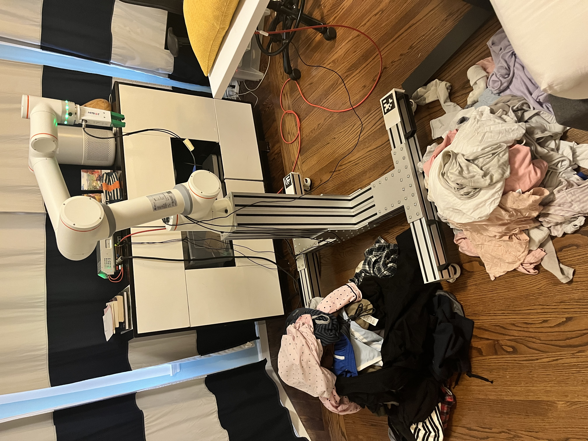

# Laundry-Sorting
Sorting laundry with a robotic arm and CV. All CV and arm controlling processes are executed on a 2009 MacBook since the robotic arm's SDK requires Ubuntu for operation and this is the only current device I have to run linux on.

### **[Full Video](https://www.youtube.com/watch?v=kl7d4tLsklM)**

## Fully Sorted Piles (Dark/Light)

